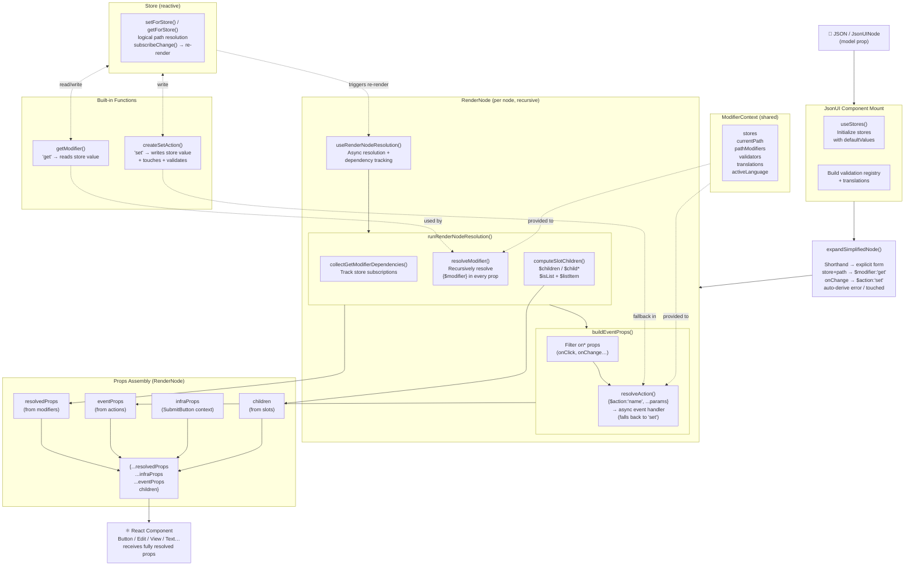

# JSON UI Rendering Pipeline

How the component rendering works, from the JSON model until props are passed to the React component.

## Key Stages

1. **Mount** — `JsonUI` initializes stores and validation from `defaultValues`
2. **Expand** — `expandSimplifiedNode()` converts shorthand `{store, path}` into explicit `$modifier`/`$action` descriptors
3. **RenderNode (recursive)** — for each node:
   - `resolveModifier()` recursively evaluates all `{$modifier}` objects in props → static values
   - `buildEventProps()` converts `on*` props with `{$action}` specs → async React event handlers
   - `computeSlotChildren()` resolves `$children`/`$child*` recursively, handling lists
4. **Props merge** — resolved props, event handlers, infra props, and children are spread into a single object
5. **React component** receives the fully-resolved plain props

## Key Files

| Stage               | File                                                              |
| ------------------- | ----------------------------------------------------------------- |
| Entry Point         | `packages/react/src/JsonUI/JsonUI.tsx`                            |
| Node Expansion      | `packages/core/src/JsonUI/expandSimplifiedNode.ts`                |
| RenderNode Core     | `packages/react/src/JsonUI/RenderNode.tsx`                        |
| Resolution Hook     | `packages/react/src/JsonUI/renderNode/useRenderNodeResolution.ts` |
| Core Resolution     | `packages/core/src/JsonUI/renderNode/runResolution.ts`            |
| Modifier Resolution | `packages/core/src/JsonUI/resolveModifier.ts`                     |
| Action Resolution   | `packages/core/src/JsonUI/resolveAction.ts`                       |
| Event Props Builder | `packages/react/src/JsonUI/renderNode/buildEventProps.ts`         |
| Slot Children       | `packages/react/src/JsonUI/renderNode/computeSlotChildren.tsx`    |
| Get Modifier        | `packages/core/src/JsonUI/getModifier.ts`                         |
| Set Action          | `packages/core/src/JsonUI/setAction.ts`                           |
| Store               | `packages/core/src/store.ts`                                      |
| Types               | `packages/core/src/types.ts`                                      |
