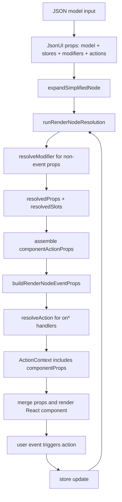

## Props

### model: _any_

The `model` is the most important property. It contains the UI definitions and the business logic, usually a JSON structure or object structure which can come from an API response or a predefined JSON file for example.

### defaultValues: _Record<string, object>_

If the JsonUI needs to initialise data, this is what the JsonUI is working on.
The `defaultValues` should be the name of the store and the data of it. For example, if the name of the store is a `questionnaire` and the initial data of a profile.

```js
<JsonUI
  model={...}
  defaultValues={{ questionnaire:{ profile:{ firstName:'John', lastName:'Down' }}}}
/>
```

It will be able to access with this example:

```json
{
  "$comp": "Edit",
  "value": {
    "$modifier": "get",
    "store": "questionnaire",
    "path": "/profile/firstName"
  }
}
```

### components: _Record<string, React.ReactType>_

This is the way to add more components. For example to add MUI Switch component:

```js
import Switch from '@mui/material/Switch'

const MySwitch = (...props) => <Switch {...props} />
const model = {
  $comp: 'Switch',
  checked: {
    $modifier: 'get',
    store: 'data',
    path: 'subscribe',
  },
  onChange: {
    $action: 'set',
    store: 'data',
    path: 'subscribe',
  },
}

return <JsonUI model={model} components={{ Switch: MySwitch }} />
```

### modifiers: _Record<string, (params, context) => unknown>_

Use this prop to register handlers referenced by `"$modifier"`.

### actions: _Record<string, (params, context) => void | Promise<void>>_

Use this prop to register handlers referenced by `"$action"`. Action context always includes `componentProps`.

Action example:

```js
import Button from '@mui/material/Button'

const MyAction = ({ value }, context) => {
  console.log('Hello World', value, context.componentProps)
}
const model = {
  $comp: 'Button',
  onClick: { $action: 'MyAction', value: 42 },
}

return <JsonUI model={model} modifiers={{}} actions={{ MyAction }} components={{ Button }} />
```

Modifier example:

```js
const MyModifier = ({ key }) => `value:${key}`

const model = {
  $comp: 'Text',
  $children: { $modifier: 'MyModifier', key: 'age' },
}

return <JsonUI model={model} modifiers={{ MyModifier }} actions={{}} />
```

### Rendering Flow



#### onStateExport: ({ id?: string, formState: JSONValue}) => void

When the JsonUI react component need to re-render to show a new form, need to save the previous state if it is not finished. Use id comes from JsonUI id property. Use it, to make sure it's export on the right time. Example in the storybook stories.
